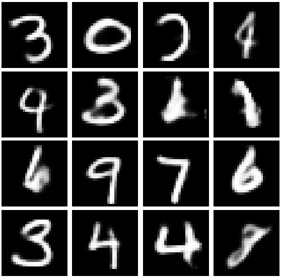
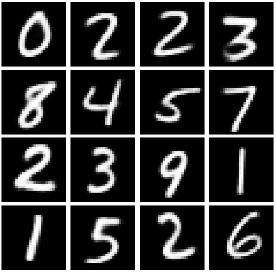
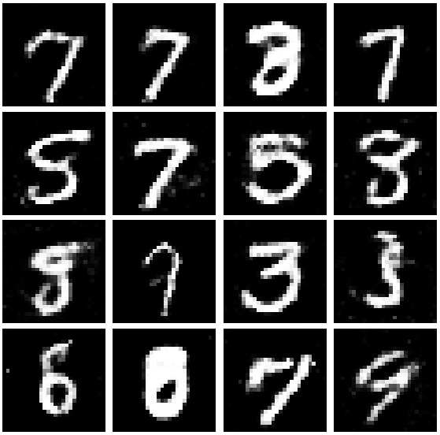
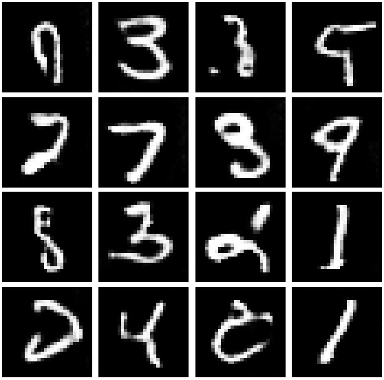
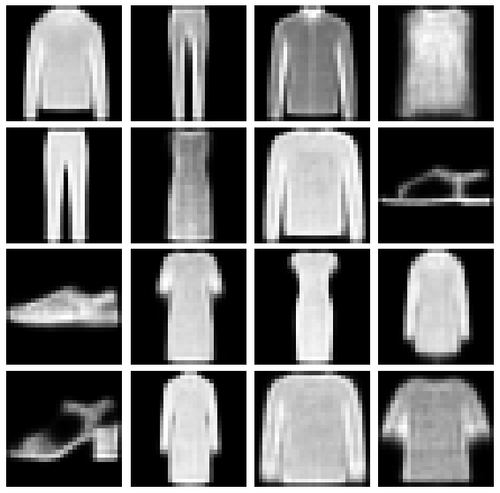
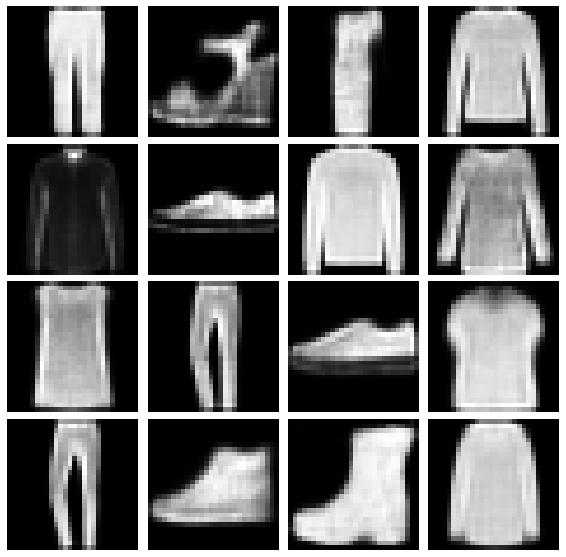
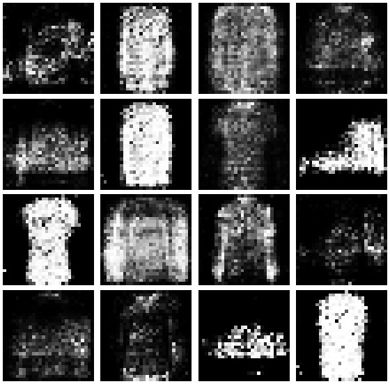
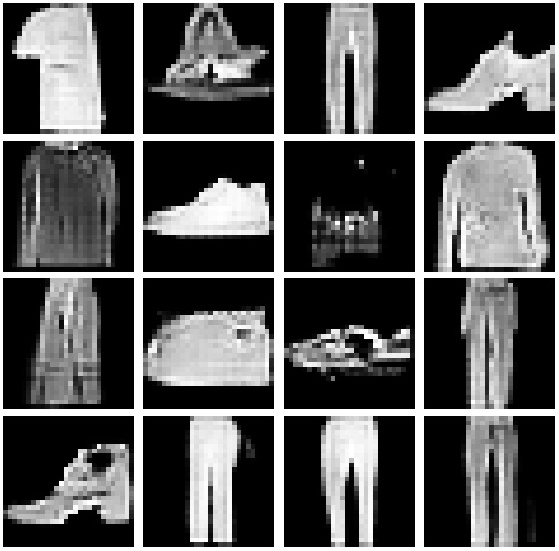
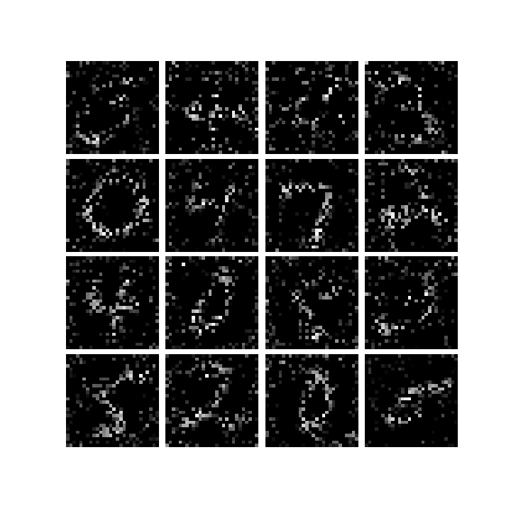
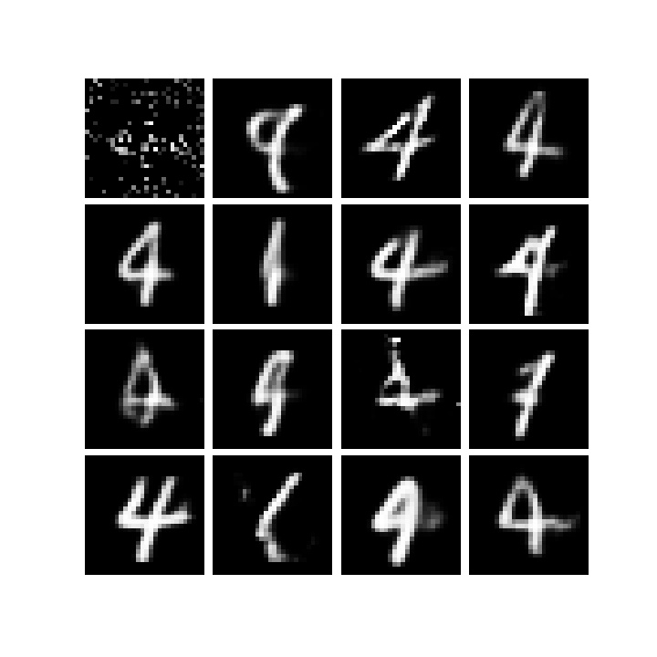

# Generative pereformance of VAEs and GANs
Reproducing the results presented in the paper **VAE with a VampPrior** by Jakub M. Tomczak  and  Max Welling (https://arxiv.org/abs/1705.07120).
In addition to reproducing the result we also compare the generative performance of the Variation Auto-encoder with different priors with two Generative Adversarial Networks (GAN).

The generative capabilities are compared by using the Interception Score (IS), which measures how diverse the set of generated images are and how similar the are to the original images.

Code for the HVAE and VampPrior is based on the [original implementation](https://github.com/jmtomczak/vae_vampprior), but translated to Tensorflow.

## Results

#### Generated images MNIST

VAE             |  HVAE - VampPrior
:-------------------------:|:-------------------------:
  |  

GAN             |  DCGAN
:-------------------------:|:-------------------------:
  |  

#### Generated images Fashion MNIST

VAE - VampPrior             |  HVAE - VampPrior
:-------------------------:|:-------------------------:
  |  

GAN             |  DCGAN
:-------------------------:|:-------------------------:
  |  

Besides the generated images we also examined how the HVAE learned pseudoinput.  After training the model we found the following pseudo-inputs and  the images reconstructed from a selected pseudo-input.

 Pseudo-inputs             |  Pseudo-input reconstruction
:-------------------------:|:-------------------------:
  |  
